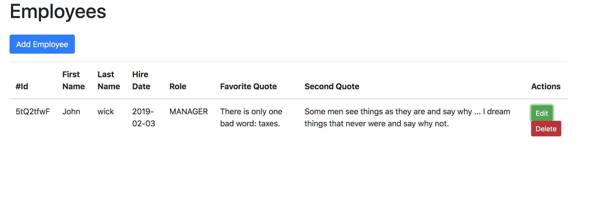
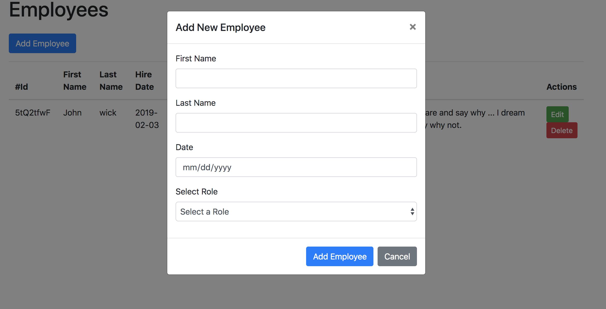
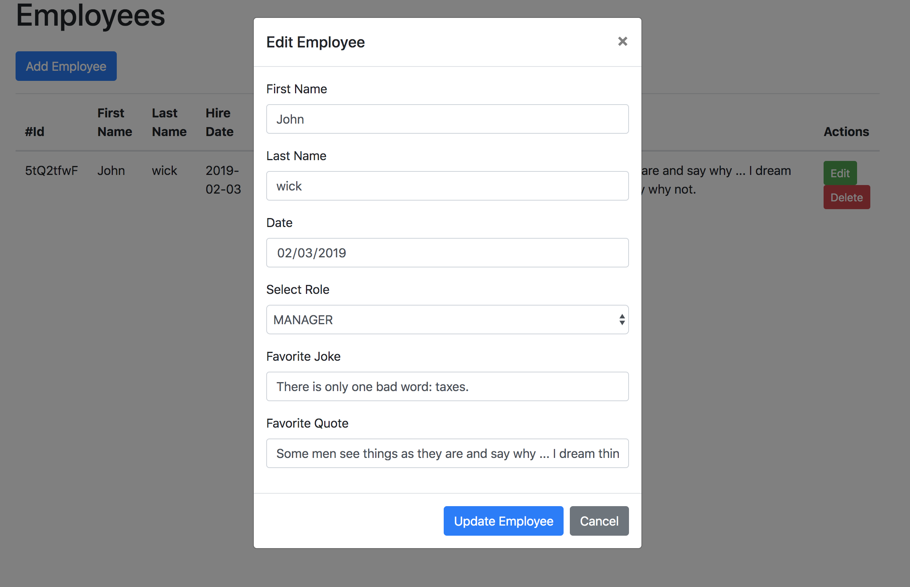
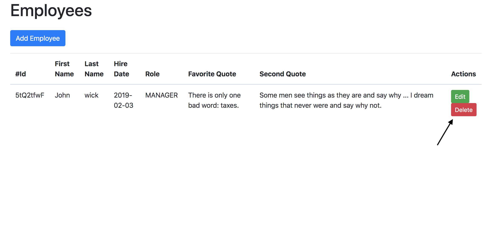

This project was bootstrapped with [Create React App](https://github.com/facebook/create-react-app).

## Running Locally


```sh
$ git clone https://github.com/saicharanrao/employee-react-app.git 
$ cd employee-react-app
$ npm install
$ npm start
```

App should now be running on [localhost:3000](http://localhost:3000/). If this port is already in use it may use [localhost:3001](http://localhost:3001/).  


### 1) List All Employees

This application by default displays the list of employees when running.



### 2) Add New Employee

Please click on the `Add Employee` button in the main page.



### 3) Edit Existing Employee

Please click on the `Edit` button beside the record to edit details.



### 4) Delete Existing Employee

Please click on the `Delete` button beside the record to delete the record.

